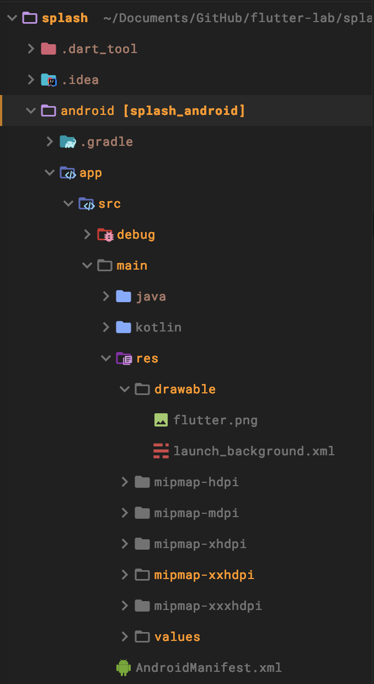

# 2020/01/22 Adding a splash screen and launch screen to an Android app

# Adding a splash screen and launch screen to an Android app

- Flutter では初期化中の画面である、ラウンチスクリーンとスプラッシュスクリーンをサポートしている。

# Android launch screen

- Android アプリでは ラウンチスクリーンという初期化中に表示する Drawable を用意しています。
- Flutter では FlutterActivityを表示する前に、起動画面を表示する機能を提供しています。

## Define a launch theme

- style.xml の windowBackground に Drawable を指定すればラウンチスクリーンとして表示されます。

```xml
<style name="LaunchTheme" parent="@android:style/Theme.Black.NoTitleBar">
    <item name="android:windowBackground">@drawable/launch_background</item>
</style>
```

```xml
<layer-list xmlns:android="http://schemas.android.com/apk/res/android">
    <item android:drawable="@android:color/white" />
    <item>
        <bitmap
            android:gravity="center"
            android:src="@drawable/flutter" />
    </item>
</layer-list>
```


## Setup FlutterActivity in AndroidManifest.xml

FlutterActivityのThemeを設定するには AndroidManifest.xml に下記の内容を記述すれば良い。

```xml
<activity
    android:name=".MyActivity"
    android:theme="@style/LaunchTheme"
    // ...
    >
    <meta-data
        android:name="io.flutter.embedding.android.NormalTheme"
        android:resource="@style/NormalTheme"
        />
    <intent-filter>
        <action android:name="android.intent.action.MAIN"/>
        <category android:name="android.intent.category.LAUNCHER"/>
    </intent-filter>
</activity>
```

# Flutter splash screen

## Showing a Drawable splash screen

- FlutterActivity, FlutterFragment, FlutterView などにも Splash を入れられる
- ActivityとFragmentとViewでやり方が違うのでそれぞれに応じて実装する必要がある。