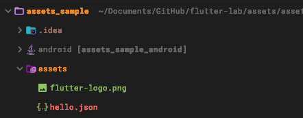
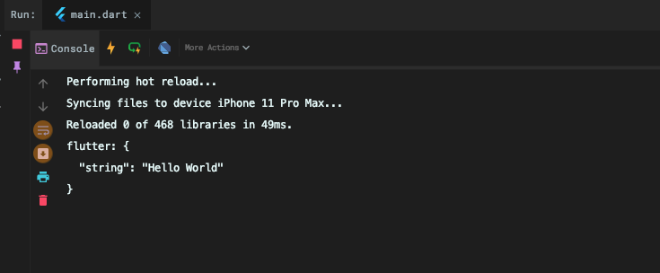
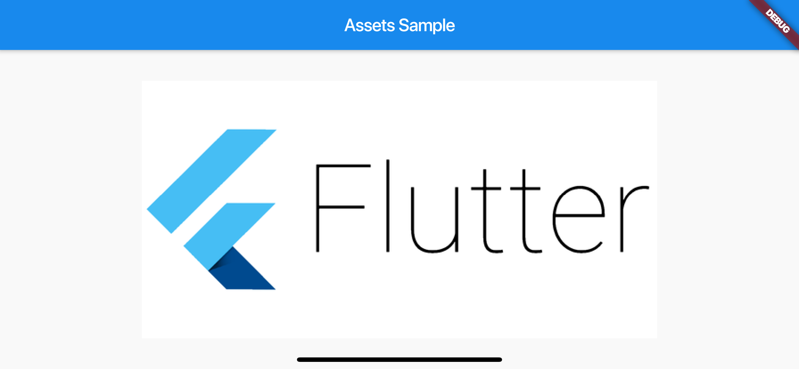
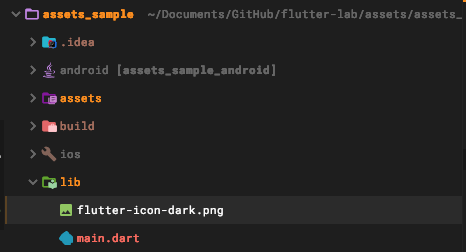

# 2020/01/13 Adding asset and images

# Adding assets and images

https://flutter.dev/docs/development/ui/assets-and-images

- assets ファイルはデプロイ時にアプリにバンドルすることができる
- バンドルした assets ファイルはランタイムからアクセスできる
- assets は JSON ファイルなどの静的データや設定ファイル、  
  JPEG WebP GIF PNG BMP などの画像ファイルデータ
  
# Specifying assets

- `assets` ファイルをバンドルするには `pubspec.yaml`にどの`assets`が必要なのか記述しなければならない。
- ファイルごとに指定する場合、次のように記述できる。

```
flutter:
  assets:
    - assets/my_icon.png
    - assets/background.png
```

- ディレクトリを指定する場合、次のように記述できる。

```
flutter:
  assets:
    - assets/
```

# Asset variant

- バリアントに対応しているので、別のバージョンでは別のコンテキストの画像を表示できる。
- 例えば通常は /graphics/background.pngは通常 assets、だが/graphics/dark/background.pngのようにダークモードで利用する画像、つまりヴァリアントの assetsをサポートしている。
- 解像度に適したアセットを取得するための仕組みとして、assets variant が定義されている、
  これらのメカニズムはロケールなどのバリアントを定義するように拡張されるかもしれない
  
# Loading assets

- アプリをビルドすると AssetBundle オブジェクトを通して、 assets にアクセスできるようになります。
- assetsBundleの主に2つのメソッドに論理キーを設定して、文字や画像、バイナリの assets を取得できる。
- `pubspec.yaml`ファイルに記述したパスが論理キーとしてマッピングされるようになっています。

## Loading textassets

- Flutter は 簡単に assets bundle にアクセスするための rootBundle オブジェクトを所持している。
- rootBundle を使用することで assets を読み込むことを可能にしている

- 推奨される Assets Bundle の取得方法は、現在のコンテキストの Assets を取得するために
DefaultAssetBundleを利用した方法です。
- この方法であれば、デフォルトの AssetsBundle ではなく、別のコンテキストで起動されたときに別の Assets に置き換えることができます。これはローカライズやテストで役立てることができます。

- rootBundleを利用してJSONファイルを読み込む例は次の通りです。

### 実装してみる


```
flutter:
  assets:
    - assets/hello.json
```

```
Future<String> loadAsset() async {
  return rootBundle.loadString('assets/hello.json');
}

```



## Loading images

- Flutter ではデバイスのピクセル比に適した解像度の画像を読み込むことができる

### Declaring resolution-aware image assets

- Flutter ではデバイスのピクセル比に適した解像度の画像を読み込むことができる
- 次のようにヴァリアントを2.0と3.0とするとピクセル比に応じたアセットを作成することができる

### 実装してみる


```
flutter:
  assets:
    - assets/hello.json
    - assets/flutter-logo.png
```

```
class _PageState extends State<Page> {
  @override
  Widget build(BuildContext context) {
    return Scaffold(
      appBar: AppBar(title: Text(widget.title),),
      body: Center(child: Image(image: AssetImage('assets/flutter-logo.png'))),
    );
  }
}
```



## Asset images in package dependencies

- パッケージの中にある画像を取得するには、引数にパッケージ名を指定する

```
 AssetImage('icons/heart.png', package: 'my_icons')
```

### 実装してみる


```dart
   Image(image: AssetImage('flutter-icon-dark.png', package : 'assets_sample')
```

```
  assets:
    - assets/hello.json
    - assets/flutter-logo.png
    - packages/assets_sample/flutter-icon-dark.png
```