# 2019/12/31 - Flutter のレイアウト(https://flutter.dev/docs/development/ui/layout)

# Lay out a widget

- ウィジェットは、UIの構築に使用されるクラスです。
- ウィジェットは、レイアウト要素とUI要素の両方に使用されます。
- 単純なウィジェットを作成して、複雑なウィジェットを作成します。

## 1. Select a layout widget
- 表示されているウィジェットを配置、制約、および整列する行、列、グリッドなどのウィジェットである
- コンテナは子要素をカスタマイズできるウィジェットです。

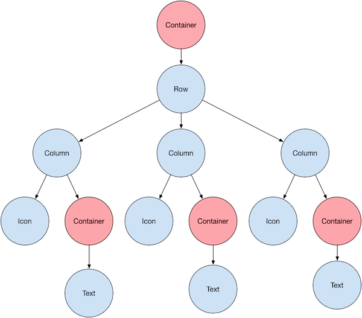

## 2. Create a visible widget
- 特になし


## 3. Add the visible widget to the layout widget

- Center や Container は 1つの子要素を格納できる
- Row Column ListView Stack は複数の子要素を格納できる。


## 4. Add the layout widget to the page
- 各ウィジェットには `build` が用意されており、 `build`を実行することでウィジェットを表示できる。
- Material Design のアプリを作りたい場合は`Scaffold`ウィジェットを利用することで作成できる。

```dart
class MyApp extends StatelessWidget {
  @override
  Widget build(BuildContext context) {
    // MaterialApp と記述して囲むと Material Design が適用される
    return MaterialApp(
      title: 'Flutter layout demo',
      home: Scaffold(
        appBar: AppBar(
          title: Text('Flutter layout demo'),
        ),
        body: Center(
          child: Text('Hello World'),
        ),
      ),
    );
  }
}
```

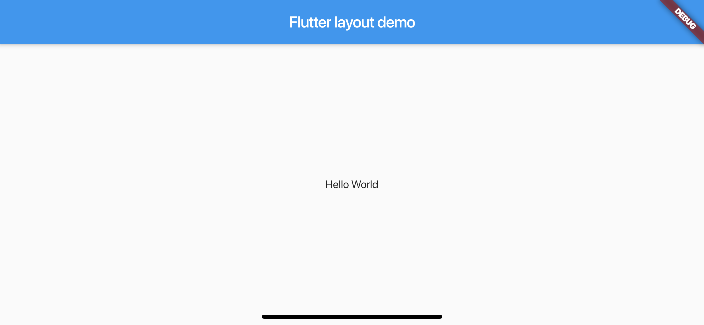

`Scaffold`を利用したくないなら、次のようなコードになる。
`Scaffold`を利用しないとアプリバーなどの表示が消える

```dart
class MyApp extends StatelessWidget {
  @override
  Widget build(BuildContext context) {
    return Container(
      decoration: BoxDecoration(color: Colors.white),
      child: Center(
        child: Text(
          'Hello World',
          textDirection: TextDirection.ltr,
          style: TextStyle(
            fontSize: 32,
            color: Colors.black87,
          ),
        ),
      ),
    );
  }
}
```

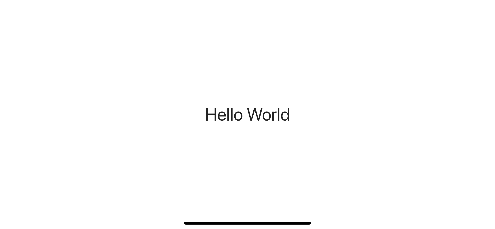

# Lay out multiple widgets vertically and horizontally

- 最も簡単なレイアウトパターンは縦か横、つまり列や行に沿ってウィジェットを並べる方法
- Flutterで行や列を作るには、`Row` `Column` クラスを利用します。

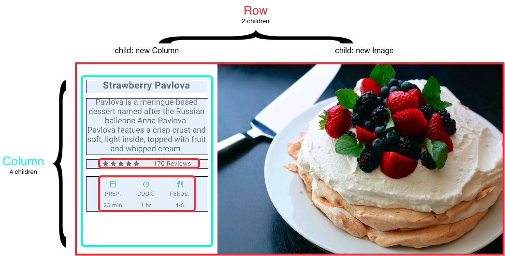

- `Row` `Column` は最もプリミティブなウィジェットです。
- `Row` `Column` 以外にも特定の用途を満たすためのウィジェットである、
  `ListTile` `ListView` などのウィジェットが用意されている。
  
```dart
void main() => runApp(MyApp());
class MyApp extends StatelessWidget {
  @override
  Widget build(BuildContext context) {
    return MaterialApp(
      title: 'Flutter layout demo',
      home: Scaffold(
        appBar: AppBar(
          title: Text('Flutter layout demo'),
        ),
        body: Center(
          child: ListView(children: <Widget>[
            ListTile(title: Text("Title"), subtitle: Text("Sub Title")),
            ListTile(title: Text("Title"), subtitle: Text("Sub Title")),
            ListTile(title: Text("Title"), subtitle: Text("Sub Title")),
            ListTile(title: Text("Title"), subtitle: Text("Sub Title")),
            ListTile(title: Text("Title"), subtitle: Text("Sub Title")),
            ListTile(title: Text("Title"), subtitle: Text("Sub Title")),
            ListTile(title: Text("Title"), subtitle: Text("Sub Title")),
            ListTile(title: Text("Title"), subtitle: Text("Sub Title")),
            ListTile(title: Text("Title"), subtitle: Text("Sub Title")),
            ListTile(title: Text("Title"), subtitle: Text("Sub Title")),
          ],)
        ),
      ),
    );
  }
}
```


## Aligning widgets

- `Row` や `Column` の方向に沿っているのが`Main Axis`で、その方向に直角に沿っているのが`Cross Axis`
- 例えば`MainAxisAlignment`や`CrossAxisAlignment`などでもその表現が使われている。
- [MainAxisAligment](https://api.flutter.dev/flutter/rendering/MainAxisAlignment-class.html) と [CrossAxisAlignment](https://api.flutter.dev/flutter/rendering/CrossAxisAlignment-class.html)に利用できる種類は定義されている。

| 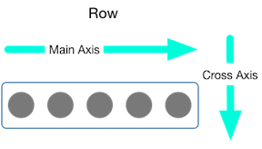 | 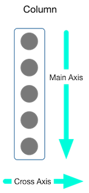 |
| -- | -- |

## Sizing widgets
- `Expanded`を利用すれば、あるウィジェットを特定領域に埋めたレイアウトが作成できる。


```dart
Row(
  crossAxisAlignment: CrossAxisAlignment.center,
  children: [
    Expanded(
      child: Image.asset('images/pic1.jpg'),
    ),
    Expanded(
      child: Image.asset('images/pic2.jpg'),
    ),
    Expanded(
      child: Image.asset('images/pic3.jpg'),
    ),
  ],
);
```

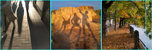

- `Expanded`には`flex`を指定できるようになっており、`flex`で埋めるときの割合を指定できる

```dart
Row(
  crossAxisAlignment: CrossAxisAlignment.center,
  children: [
    Expanded(
      child: Image.asset('images/pic1.jpg'),
    ),
    Expanded(
      flex: 2,
      child: Image.asset('images/pic2.jpg'),
    ),
    Expanded(
      child: Image.asset('images/pic3.jpg'),
    ),
  ],
);
```

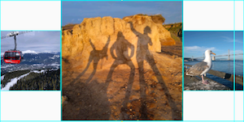

## Packing widgets

- `Row` `Column` デフォルトでは可能な限りスペースを利用する
- 子要素を密接させたい場合は、`mainAxizSize`を`MainAxizSize.min`に設定する。

```dart
Row(
  mainAxisSize: MainAxisSize.min,
  children: [
    Icon(Icons.star, color: Colors.green[500]),
    Icon(Icons.star, color: Colors.green[500]),
    Icon(Icons.star, color: Colors.green[500]),
    Icon(Icons.star, color: Colors.black),
    Icon(Icons.star, color: Colors.black),
  ],
)
```

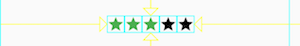

## Nesting rows and columns

- 必要な深さのレイアウトを定義できる

# Common layout widgets

- Flutterにはリッチなレイアウトウィジェットが用意されている
- レイアウトウィジェットの一覧は[Widget catalog](https://flutter.dev/docs/development/ui/widgets)か[API Reference DOCS](https://api.flutter.dev/index.html)に記載されている。
- ウィジェットは`Material library`と`widget library`という2つのカテゴリがある
- Material Design で作るなら Material Component Library を利用する感じになる

## Standard widgets

- `Container`や`GridView`、`ListView` `Stack`と呼ばれるウィジェットが`Standard widgets`と呼ばれる。

## Material widgets

- `Card` や `ListTIle` と呼ばれるウィジェットが `Material widgets` と呼ばれる


## Container

- 複数のウィジェットを分割するためにこの`Container`が多くのレイアウトで使われている。
- `Container`では`Padding` `Margins` `Borders`を追加することができる
- `Container`では`Background` の色または画像を変えることができる
- `Container`には１つの子ウィジェットをを含めることができる、
  しかし`Row`や`Column`を利用すればウィジェットツリーを作ることができる。
  
## GridView

- グリッドでウィジェットを並べることができる
- ウィジェットを並べる際のカラムの数は`GridView.count`で決められる
- またカラムの数で指定するだけでなく、`GridView.extent`でピクセル最大幅で指定できる

|  | 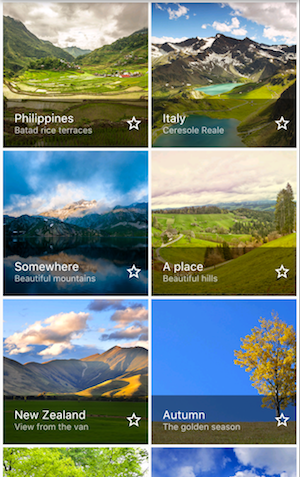|
| ------- | ------- |

## ListView
- 特定の要素をリストで表示することができる
- 要素数が多い場合にはスクロールすることができる。
- 垂直か水平かで並べることができる。

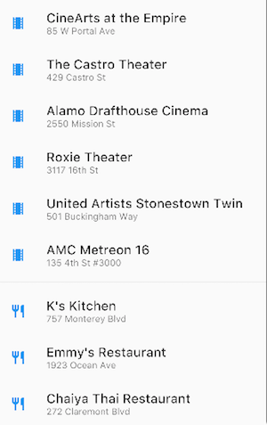

## Stack

- Stackを利用すればベースのウィジェットをアレンジできる
- 動きとしてウィジェットを積み重ねられるようになっている。
- そのため次のようにサークル画像の上にテキストを貼り付けることができる


## Card

- Material Card の実装です。
- Material Library の他のウィジェットによく含まれるもの
- 例えば Card は ListTile などに含まれています
- Flutter で Card は角丸と影を与えて 3D に見えるようにしている。
- または elevation を操作することで書けの深さを変化させる

| 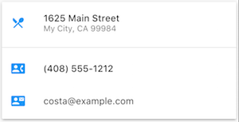 | 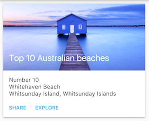 |
| ------- | ------- |

## ListTile

- ListTile は ３つの要素をテキストやアイコンを埋め込むことができる。
- `Row`を簡単にカスタマイズするときに利用できる

