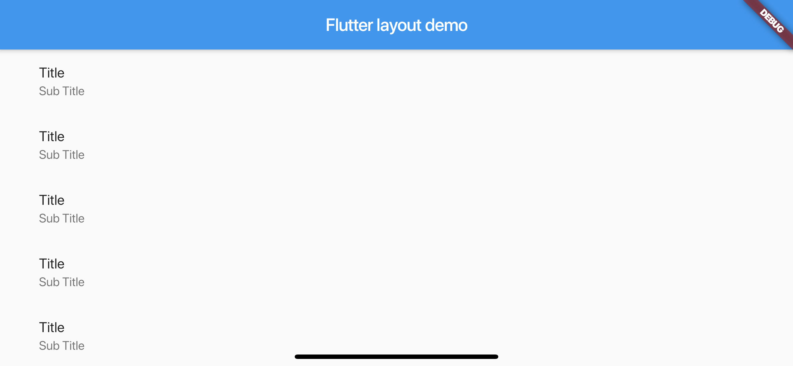

# 2019/12/31 - Flutter のレイアウト(https://flutter.dev/docs/development/ui/layout)

# Lay out a widget

- ウィジェットは、UIの構築に使用されるクラスです。
- ウィジェットは、レイアウト要素とUI要素の両方に使用されます。
- 単純なウィジェットを作成して、複雑なウィジェットを作成します。

# 1. Select a layout widget
- 表示されているウィジェットを配置、制約、および整列する行、列、グリッドなどのウィジェットである
- コンテナは子要素をカスタマイズできるウィジェットです。


# 2. Create a visible widget
- 特になし


# 3. Add the visible widget to the layout widget

- Center や Container は 1つの子要素を格納できる
- Row Column ListView Stack は複数の子要素を格納できる。


# 4. Add the layout widget to the page
- 各ウィジェットには `build` が用意されており、 `build`を実行することでウィジェットを表示できる。
- Material Design のアプリを作りたい場合は`Scaffold`ウィジェットを利用することで作成できる。

```dart
class MyApp extends StatelessWidget {
  @override
  Widget build(BuildContext context) {
    // MaterialApp と記述して囲むと Material Design が適用される
    return MaterialApp(
      title: 'Flutter layout demo',
      home: Scaffold(
        appBar: AppBar(
          title: Text('Flutter layout demo'),
        ),
        body: Center(
          child: Text('Hello World'),
        ),
      ),
    );
  }
}
```


`Scaffold`を利用したくないなら、次のようなコードになる。
`Scaffold`を利用しないとアプリバーなどの表示が消える

```dart
class MyApp extends StatelessWidget {
  @override
  Widget build(BuildContext context) {
    return Container(
      decoration: BoxDecoration(color: Colors.white),
      child: Center(
        child: Text(
          'Hello World',
          textDirection: TextDirection.ltr,
          style: TextStyle(
            fontSize: 32,
            color: Colors.black87,
          ),
        ),
      ),
    );
  }
}
```


# Lay out multiple widgets vertically and horizontally

- 最も簡単なレイアウトパターンは縦か横、つまり列や行に沿ってウィジェットを並べる方法
- Flutterで行や列を作るには、`Row` `Column` クラスを利用します。


- `Row` `Column` は最もプリミティブなウィジェットです。
- `Row` `Column` 以外にも特定の用途を満たすためのウィジェットである、
  `ListTile` `ListView` などのウィジェットが用意されている。
  
```dart
void main() => runApp(MyApp());
class MyApp extends StatelessWidget {
  @override
  Widget build(BuildContext context) {
    return MaterialApp(
      title: 'Flutter layout demo',
      home: Scaffold(
        appBar: AppBar(
          title: Text('Flutter layout demo'),
        ),
        body: Center(
          child: ListView(children: <Widget>[
            ListTile(title: Text("Title"), subtitle: Text("Sub Title")),
            ListTile(title: Text("Title"), subtitle: Text("Sub Title")),
            ListTile(title: Text("Title"), subtitle: Text("Sub Title")),
            ListTile(title: Text("Title"), subtitle: Text("Sub Title")),
            ListTile(title: Text("Title"), subtitle: Text("Sub Title")),
            ListTile(title: Text("Title"), subtitle: Text("Sub Title")),
            ListTile(title: Text("Title"), subtitle: Text("Sub Title")),
            ListTile(title: Text("Title"), subtitle: Text("Sub Title")),
            ListTile(title: Text("Title"), subtitle: Text("Sub Title")),
            ListTile(title: Text("Title"), subtitle: Text("Sub Title")),
          ],)
        ),
      ),
    );
  }
}
```



- `Row` や `Column` の方向に沿っているのが`Main Axis`で、その方向に直角に沿っているのが`Cross Axis`
- 例えば`MainAxisAlignment`や`CrossAxisAlignment`などでもその表現が使われている。

|  |  |
| -- | -- |

- `MainAxiAlignment`と`CrossAxisAlignment`の種類は次に定義されている。
-  [MainAxisAligment](https://api.flutter.dev/flutter/rendering/MainAxisAlignment-class.html) と [CrossAxisAlignment](https://api.flutter.dev/flutter/rendering/CrossAxisAlignment-class.html)

