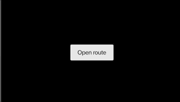

# 2020/01/14 Navigation and routing

# Navigation and routing
https://flutter.dev/docs/development/ui/navigation


## Navigate to a new screen and back
https://flutter.dev/docs/cookbook/navigation/navigation-basics

- Android では Route は Activity 、 iOS では ViewController ですが、
  Flutter では Route は Widget になります。
- Flutter では 定義した Widget　を定義して、
  Navigator を利用して、その定義したウィジェットを遷移させるようになっている。
- Navigator.push()を利用して、指定したルートに遷移、Navigator.pop()を利用して、
  遷移したウィジェットから前に表示していたウィジェットに戻る。
  
```dart
class MyApp extends StatelessWidget {
  // This widget is the root of your application.
  @override
  Widget build(BuildContext context) {
    return MaterialApp(
      title: 'Flutter Demo',
      theme: ThemeData(
        primarySwatch: Colors.blue,
      ),
      home: OneRoute(),
    );
  }
}
```

```dart
class OneRoute extends StatelessWidget {
  @override
  Widget build(BuildContext context) {
    return Center(
      child: RaisedButton(
        child: Text('Open route'),
        onPressed: () {
          Navigator.push(context, MaterialPageRoute(builder: (context) => TwoRoute()));
        },
      ),
    );
  }
}
```

```dart
class TwoRoute extends StatelessWidget {
  @override
  Widget build(BuildContext context) {
    return Center(
      child: RaisedButton(
        child: Text('Open route'),
        onPressed: () {
          Navigator.pop(context, MaterialPageRoute(builder: (context) => OneRoute()));
        },
      ),
    );
  }
}
```


## Navigate with named routes
https://flutter.dev/docs/cookbook/navigation/named-routes

- Navigater.push() を利用した場合だと次の問題が出てくる
  - 同じルートへのアクセスが面倒になる。
  - 同じ画面だが初期化する引数がことなるルートへの遷移が面倒になる
- Navigater.pushName() を利用すれば名前付きで遷移先を指定できるようになる。上記に書いた問題が少し解決する。（名前でだどれるようになる、同じ画面への遷移も区別しやすくなる）
- MaterialApp に initialRoute、routesを設定する。
  これで名前付きで遷移先を指定することができるようになる。
  

```dart
class MyApp extends StatelessWidget {
  // This widget is the root of your application.
  @override
  Widget build(BuildContext context) {
    return MaterialApp(
      title: 'Flutter Demo',
      initialRoute: '/',
      routes: {
        // When navigating to the "/" route, build the FirstScreen widget.
        '/': (context) => OneRoute(),
        // When navigating to the "/second" route, build the SecondScreen widget.
        '/second': (context) => TwoRoute(),
      },
      theme: ThemeData(
        primarySwatch: Colors.blue,
      ),
    );
  }
}
```

```dart
class OneRoute extends StatelessWidget {
  @override
  Widget build(BuildContext context) {
    return Center(
      child: RaisedButton(
        child: Text('Open route'),
        onPressed: () {
          Navigator.pushNamed(context, '/second');
        },
      ),
    );
  }
}
```

```dart
class TwoRoute extends StatelessWidget {
  @override
  Widget build(BuildContext context) {
    return Center(
      child: RaisedButton(
        child: Text('Open route'),
        onPressed: () {
          Navigator.pop(context);
        },
      ),
    );
  }
```

